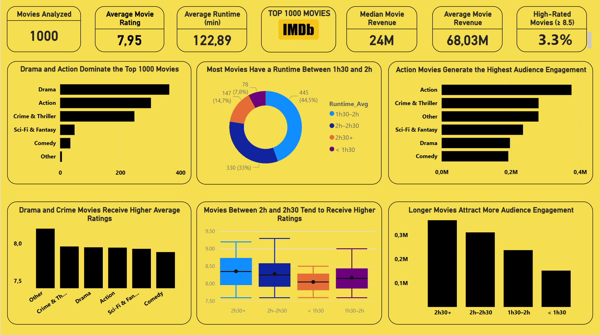
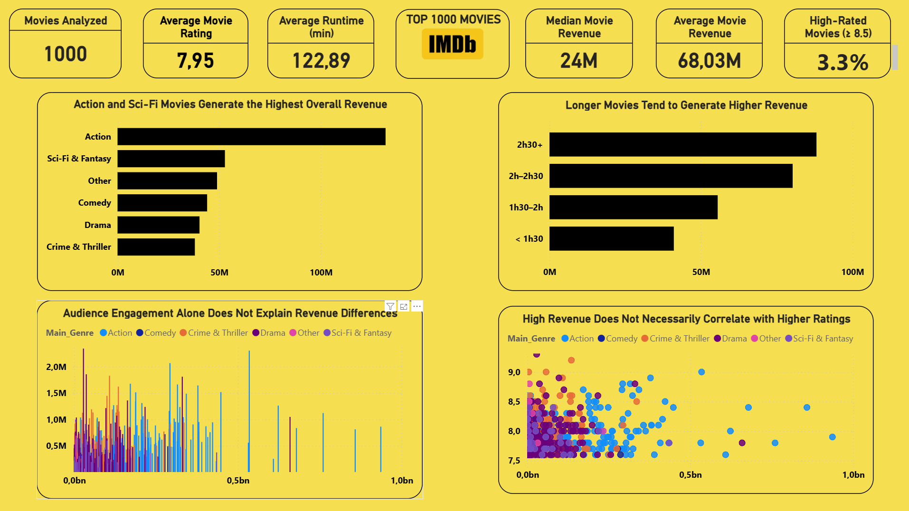
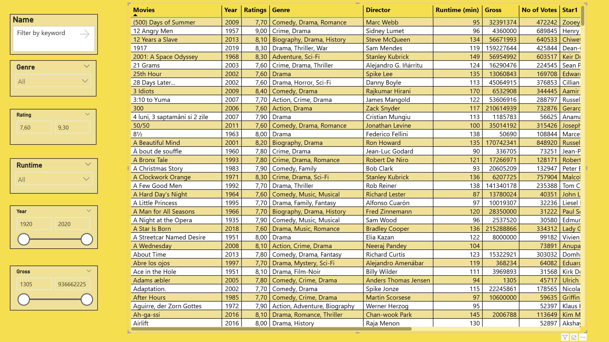

# 🎬 IMDB Top 1000 Movies — Power BI Dashboard

## 📌 Business Context & Dashboard Objective

**This dashboard helps a movie studio or streaming platform decide which types of movies to produce or acquire by analyzing movie quality, popularity, audience engagement, and revenue performance.**

In a highly competitive content market, stakeholders need to understand the trade-offs between:
- Critical acclaim (IMDB ratings)
- Audience reach and engagement (number of votes)
- Movie format choices (runtime)
- Commercial performance (gross revenue)

This dashboard is designed as a **decision-support tool**, not a predictive model.  
Its purpose is to provide **clear, data-driven insights** that support strategic discussions around content acquisition and production.

---

## 🔥 Key Insights from the Analysis
- **Action and Sci-Fi/Fantasy** generate the highest overall revenue, despite **Drama** being the most represented genre
- Movies lasting **2h to 2h30** receive the highest average ratings
- **Longer films (>2h)** attract significantly more audience engagement and higher revenue
- **High IMDB ratings do not guarantee high box office success** – there is no strong correlation
- Only **3.3%** of the Top 1000 movies are rated 8.5 or higher

---

## 🎯 Dashboard Objectives
- Provide a **high-level overview** of movie performance across quality, format, engagement, and revenue
- Enable **interactive exploration** of movies using business-relevant filters
- Highlight **patterns and trade-offs** between ratings, audience engagement, and revenue
- Support **non-technical stakeholders** through clear visual storytelling

---

## 📂 Data Source & Dataset Transformation

### Original Dataset
The initial dataset was sourced from Kaggle:  
https://www.kaggle.com/datasets/harshitshankhdhar/imdb-dataset-of-top-1000-movies-and-tv-shows

The raw dataset (`imdb_top_1000.csv`) contained:
- Mixed data types (numerical values stored as text)
- Multi-valued categorical fields (multiple genres per movie)
- Text-based numeric fields (runtime and gross revenue)
- Missing values, particularly in the gross revenue column

---

### Final Dataset Used for Analysis
After data cleaning and feature engineering, a structured dataset (`IMDB.csv`) was created and used for the Power BI dashboard.

Only the **final dataset (`IMDB.csv`)** is used for analysis and visualization.

---

## 🛠️ Data Preparation & Feature Engineering

### 🔹 Python-Based Data Preparation
All data preparation steps were performed in **Python using a Jupyter Notebook**, prior to loading the data into Power BI.

This approach ensures:
- Reproducibility of the data preparation process
- Clear separation between **data processing (Python)** and **data visualization (Power BI)**

---

### 🔹 Data Cleaning
- Converted text-based numerical columns into proper numeric formats:
  - IMDB Rating
  - Number of Votes
  - Runtime (converted from strings such as `"136 min"` to integer minutes)
  - Gross Revenue
- Ensured consistent data types across all columns
- Validated and handled missing values to prevent misleading KPIs

---

### 🔹 Feature Engineering
- Created a **Main_Genre** column by grouping multiple IMDB genres into high-level, business-oriented categories:
  - Action  
  - Drama  
  - Crime & Thriller  
  - Comedy  
  - Romance  
  - Sci-Fi & Fantasy  
  - Animation  
  - Other  

  This transformation improves dashboard readability and aligns with how content performance is typically analyzed at a strategic level.

- Created **runtime groups** to support format-based analysis:
  - < 1h30  
  - 1h30–2h  
  - 2h–2h30  
  - 2h30+

These engineered features enable clearer comparisons and more actionable insights.

---

## 📊 Dashboard Structure

### 1️⃣ Overview & Quality Analysis
Provides a global view of the dataset:
- Key KPIs:
  - Movies Analyzed  
  - Average Movie Rating  
  - Average Runtime (minutes)  
  - Median Movie Revenue  
  - Average Movie Revenue  
  - Percentage of High-Rated Movies (≥ 8.5)
- Distribution of movies by genre and runtime
- Analysis of ratings and audience engagement

**Key observations:**
- **Drama and Action dominate** the Top 1000 representation
- Movies between **2h and 2h30** tend to receive higher ratings
- Longer movies generally attract more audience engagement

---

### 2️⃣ Revenue & Performance Analysis
Focuses on **commercial performance**:
- Revenue comparison by genre and runtime
- Relationships between revenue, ratings, and audience engagement
- Identification of variability and outliers across movies

**Key observations:**
- **Action and Sci-Fi** generate the highest overall revenue
- Longer movies tend to generate higher revenue
- High revenue does not necessarily correlate with higher ratings
- Audience engagement alone does not explain revenue differences

---

### 3️⃣ Movie Explorer
Designed as an **operational exploration tool**:
- Interactive table with movie-level details:
  - Title, Year, Genre, IMDB Rating, Runtime, Revenue, Votes
- Dynamic filters:
  - Genre
  - IMDB Rating
  - Runtime Group
  - Release Year
  - Gross Revenue

**Business use case:**
> Identify movies matching specific quality, format, or performance criteria.

---

## 🧠 Methodology
- Descriptive and exploratory analysis only
- Emphasis on interpretability and decision support
- No causal inference or predictive modeling applied

---

## ⚠️ Limitations & Data Coverage

### Revenue Data Coverage
Gross revenue values are available for **831 movies**.  
Approximately **17% of movies lack revenue data**, often corresponding to independent or more recent releases.

As a result:
- Revenue KPIs are calculated only on non-missing values
- Median ($24M) and average ($68M) revenues remain representative of the available data
- Revenue-related insights should be interpreted as **indicative trends**, not exhaustive financial conclusions

Additional limitations:
- Gross revenue does not account for production budgets or profitability
- No inflation adjustment applied
- Revenue may vary by market and release period

---

## 📂 Project Deliverables
- `IMDB_Dashboard.pbix` — Interactive Power BI dashboard
- `data/IMDB.csv` — Cleaned and feature-engineered dataset
- `data/imdb_top_1000.csv` — Original raw dataset
- `notebooks/imdb_data_preparation.ipynb` — Python notebook used for data cleaning and feature engineering
- `screenshots/` — Dashboard preview images
- `README.md` — Project documentation

---

## 🚀 Key Takeaway
This project demonstrates my ability to:
- Translate a business question into a structured analytical approach
- Prepare and engineer real-world datasets using Python
- Build interactive Power BI dashboards for decision support
- Communicate insights clearly while respecting data limitations

---

## 📬 Contact

Feel free to reach out for feedback, questions, or to discuss the project!
